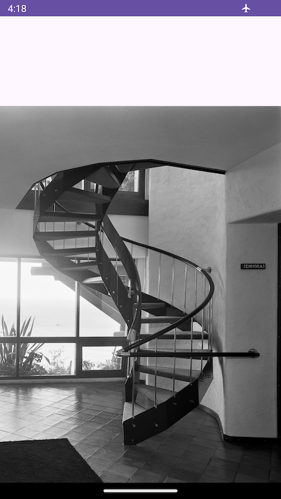

# image-android


step 1: move [image.jpg](image.jpg) to `/sdcard/DCIM/`

step 2: manually grant storage access permision to app (settings -> ...)

- minimum sdk: API21

- `app/src/main/AndroidManifest.xml`
    ```xml
    <uses-permission android:name="android.permission.MANAGE_EXTERNAL_STORAGE"
    tools:ignore="ScopedStorage" />
    ```
    - storage access permission
- `app/src/main/java/com/example/imageviewer/MainActivity.java`
    - main

